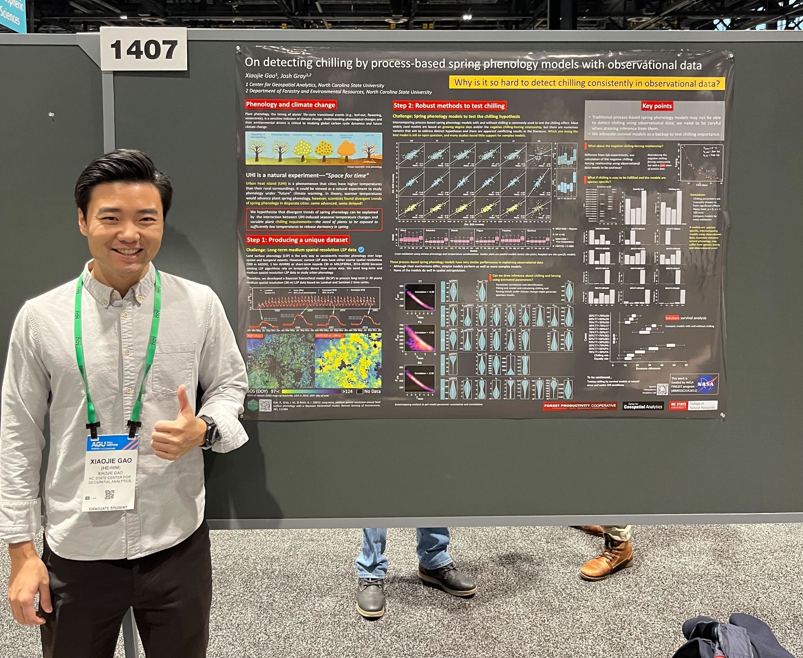
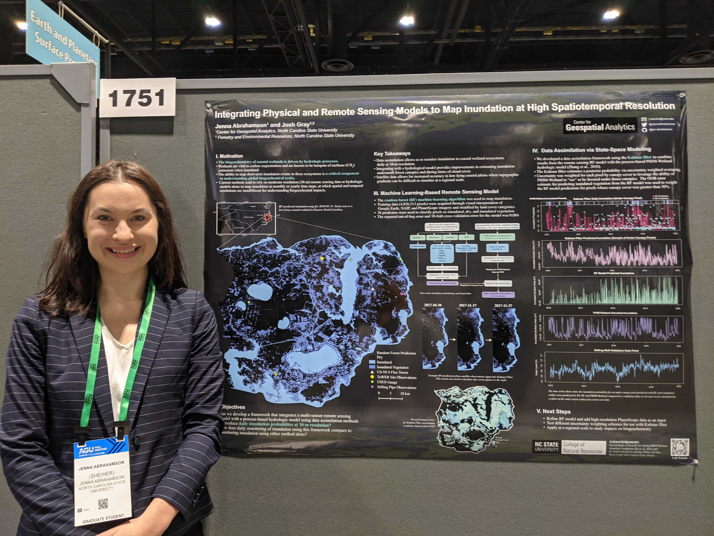
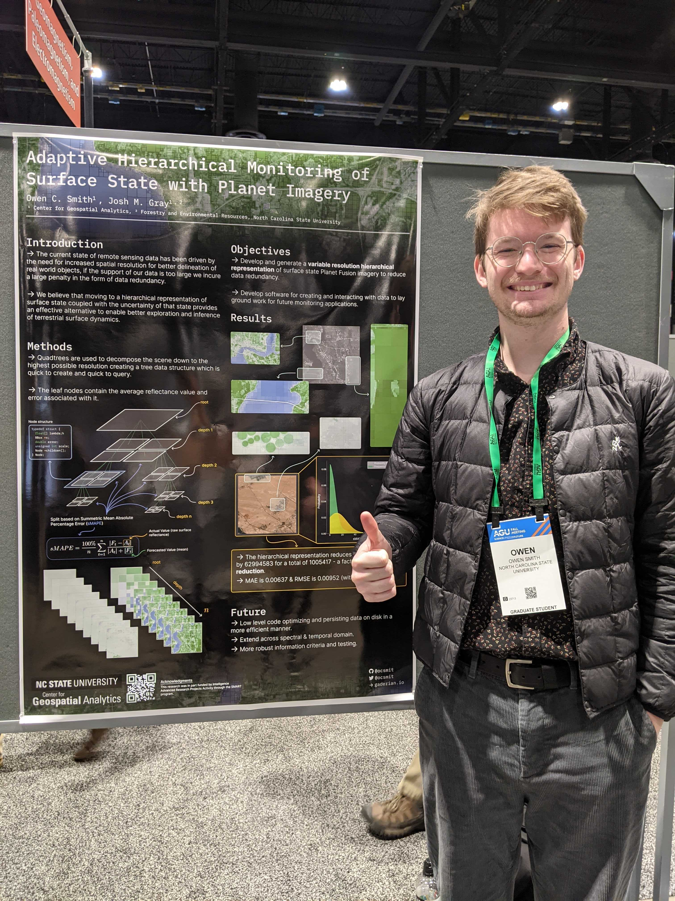
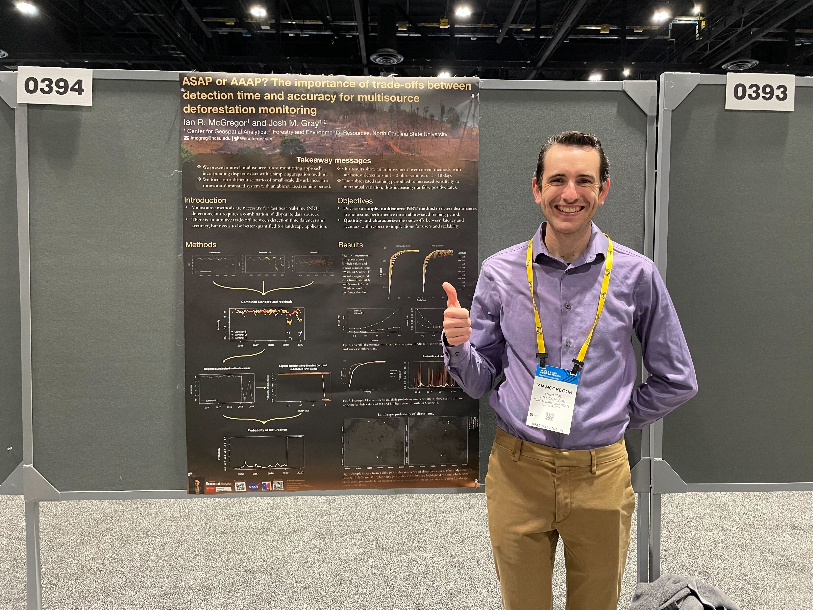

Last week (12-16 Dec), 5 of SEAL folks attended AGU2022 in-person at Chicago. Although the temperature was kind of cold, we had a lot of fun and were so excited to see old and new friends (especially meet people we have been working with virtually during the COVID period), and make connections with many scientists in the remote sensing field. 

This year, we had 1 oral and 4 poster presentations with diverse topics including monitoring smallholder agriculture, modeling plant phenology, mapping inundation, monitoring change with high spatial resolution images, and deforestation detection. The detailed information of our presentations are as follows. 

## Izzi

- **Title**: Monitoring Smallholder Agriculture at Scale with Convolutional Networks and Data Augmentation
- **Session**: GC12A-07
- **Abstract**: Remote sensing science is currently challenged to realize the tremendous potential of harnessing unprecedented velocities of satellite data. Despite continuous progress in algorithms, software, and hardware, the accelerating influx of satellite data is far outpacing our ability to turn it into information. This conundrum is exemplified in the challenge to monitor smallholder farms from orbital constellations. These small (<2 ha) and irregularly shaped fields require fine spatial resolution imagery that has not existed with the temporal frequency necessary to characterize crop types and progress. Now, PlanetScope imagery may solve this problem by offering near-daily 5 m resolution imagery for most of Earth. But realizing this potential at relevant spatial scales requires extracting information from image archives that are orders of magnitude larger than what is routinely processed now. Minimizing data requirements will be key to unlocking this new potential. Here, we show how minimal amounts of satellite data can be input into a spatio-temporal convolutional neural network (ST-CNN) and statistical algorithms to monitor crop development in smallholder fields in impoverished regions. The ST-CNN uses two well-selected PlanetScope images with distinct acquisition dates per tile to delineate individual smallholder fields. The ability to “see” distinct growth stages between fields and across time improves the performance of the ST-CNN. With the delineated field boundaries, time series of field-level satellite data were used to monitor crop development and the timing of sow and harvest dates. To generate these time series, we used a statistically-based algorithm and time series of publicly available data to identify the most contextually valuable commercial images a priori. By augmenting time series of public data with minimal amounts of commercial data, we reduced our commercial data needs by 73% without compromising on performance. The time series were input into a Bayesian hierarchical model to monitor 73% more fields than were possible without data augmentation. The field-level results can be used by nonprofits and governments to help farmers stabilize or improve crop yields amid climate changes, and the methodologies can be generalized to minimize data demands of other data-intensive research.

## Xiaojie

- **Title**: On detecting chilling by process-based spring phenology models with obervational data
- **Session**: B32D-1407
- **Abstract**: Plant phenological changes such as earlier springs and extended growing season length have been observed over much of Earth. Such changes could have tremendous ecological and biological consequences. Temperature is the main driver of spring phenology thus has been considered in various empirical and mechanistic models. Recent studies identified deficiencies in empirical models and advocate that mechanistic models are better in capturing phenological responses to temperature changes. However, existing mechanistic models have considerable structural and functional diversity, and no consensus has emerged across a robust literature. Here we use simulations and a variety of datasets to test a suite of the most commonly used mechanistic models. We show that current models have similar performance in explaining observational data, regardless of the complexity of their model structure. More importantly, we found statistically optimized model parameters are unstable and cannot even reveal the parameters when spring phenology is simulated by the same model. We caution that using mechanistic models is not a panacea, their limitations may be more severe because they are harder to identify. We suggest that all future studies be cautious of fitting these models and take care to rigorously estimate parameter uncertainty when drawing inferences from them.

## Jenna

- **Title**: Integrating Physical and Remote Sensing Models to Map Inundation at High Spatial and Temporal Resolution
- **Session**: B42J-1751
- **Abstract**: Biogeochemical processes are strongly influenced by hydrology, particularly in coastal wetlands where drastic changes in inundated and hydrologically connected areas occur over short time scales. Wetlands are vital to carbon sequestration and are known hotspots of methane (CH4) emissions when inundated. Being able to map these short-term, and possibly small-scale inundation events is therefore a critical component in accurately quantifying global biogeochemical cycles. Current remote sensing products are neither spatially nor temporally sufficient to accurately map such ephemeral inundation extents. Moreover, optical remote sensing alone usually underestimates inundation occurring under closed forest canopies. Our study created high spatiotemporal resolution inundation probabilities (daily, 10-m) in a forested, coastal wetland area by integrating predictions from a multi-source remote sensing model with the physically-based, distributed hydrologic model PIHM-Wetland. A random forest model was used to classify inundation with a suite of spectral signals obtained from Landsats 8-9, Sentinel-2, and PlanetScope imagery, Sentinel-1 SAR VV backscatter, and terrain derived features as predictors. PIHM-Wetland and remotely sensed estimates of inundation state were integrated using a Kalman filter-based approach that estimates a posterior inundation probability via uncertainty-weighted averaging. An advantage of this method is the ability for PIHM-Wetland estimates to be favored in places or at times that lack remote sensing observations (e.g., under closed vegetation canopies or during times of cloud cover). This method was used to map daily inundation for coastal wetlands within the Albemarle-Pamlico Peninsula, a 5,020 km2 region in North Carolina, United States, from 2015 to 2021 and validated with in-situ measurements. Preliminary results suggest improvement in inundation accuracy over using a single model alone, especially in densely forested portions of our study area. With the anticipation of sea-level rise and climatic variation, this novel integration scheme provides a method to capture transient inundation events in any coastal wetland, providing a crucial step forward in quantifying components of the water cycle and their interactions with biogeochemical cycles on earth.

## Owen

- **Title**: An Adaptive Spatiotemporal Approach for Monitoring Change At Scale with Planet Imagery
- **Session**: IN45B-0377
- **Abstract**: An unprecedented opportunity to monitor Earth has emerged with commercial high resolution constellations like PlanetScope. The constellation produces near daily 5 m observations for the globe, promising the opportunity to monitor change with high spatial and temporal specificity. But modern 'all-available data'' approaches have needed ever larger distributed computing investments just to keep pace with the increasing velocity of moderate resolution data production. Naive implementation of the same methods to the dramatically larger PlanetScope archive would require an equally dramatic investment in computation. But the vast majority of Earth is relatively stable the vast majority of the time. Likewise, most of Earth's surface state variability does not require 5 m imagery to adequately characterize. Knowing when and where more data is necessary to meet an objective would allow monitoring algorithms to scale by making the data much sparser in most places, most of the time. Here we explore spatiotemporal adaptive sampling schemes which balance exploration and exploitation to increase the spatial and temporal density of observations within and around areas deemed suspicious based on metrics such as Shannon's entropy and spatial autocorrelation. We applied the method to detect heavy construction events across several cities with diverse ecological and development contexts: Gangneung, Korea, Jacksonville, Florida, and Muharraq Island, UAE. The adaptive implementation achieved comparable change detection accuracy to benchmark algorithms that used all-available data, but required substantially less data to do it. Image archives grow larger each day, making it increasingly difficult for Earth monitoring methods to utilize all-available data. Approaches that minimize data, like the adaptive sampling scheme demonstrated here, will become increasingly relevant as we attempt to characterize and monitor our dynamic planet at ever larger scales.

## Ian

- **Title**: ASAP or AAAP? The Importance of Tradeoffs Between Detection Time and Accuracy for Multisource Deforestation Monitoring
- **Session**: IN45D-0394
- **Abstract**: Detecting deforestation quickly and accurately has long been a focus of remote sensing, and with the large availability of satellite data, methods have continuously advanced. To lower temporal latency and increase accuracy, a growing number of studies have pursued multi-source approaches. For instance, in areas of persistent cloud cover, using synthetic aperture radar (SAR) may be the only source of observations. Typically, near real-time (NRT) monitoring approaches have used retrospective change detection methods to maximize an accuracy metric like the F1 score. Much less attention has been paid to potential parameter tradeoffs: Can faster detections be achieved with alternative inputs, and at what cost to accuracy? We developed a novel NRT approach that monitors Landsat-8, Sentinel-2, and Sentinel-1 SAR time series in order to calculate a daily probability of disturbance. After combining standardized residuals of sensor-specific models, we converted an exponentially-weighted moving average (EWMA) to a disturbance probability. We explored how altering the EWMA sensitivity affected detection accuracy (F1) and latency (days until detection) using training data manually identified from PlanetScope in northern Myanmar. For a moderate parameterization, the algorithm detected disturbances within a median of 1-2 observations (mean of 3.3-9.5 days), with an overall F1 score of > 90%. We found two main trade-offs. The most sensitive inputs detected quickly (average of 3.3-9.5 days) compared to the conservative inputs (9.5-15.6 days) at the expense of accuracy, with overall F1 scores of >91% and >95%, respectively. Even though including S1 increased time series density, it did not result in lower latency or higher accuracy detections, primarily because of its lower signal-to-noise ratio. Once understood and accounted for, the tradeoffs can allow for applications in a variety of contexts. Plus, we anticipate that as more data becomes available (e.g. NISAR L-band SAR), the method will give faster detections. Overall, our novel, multi-source approach clearly advances NRT deforestation monitoring by providing a quick, simple, and effective way of combining multi-source satellite data.