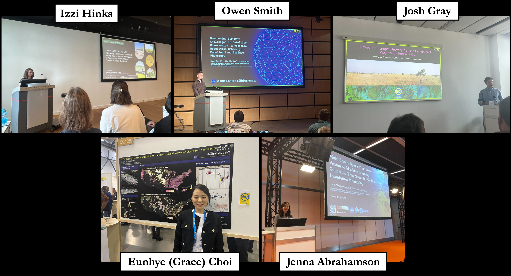
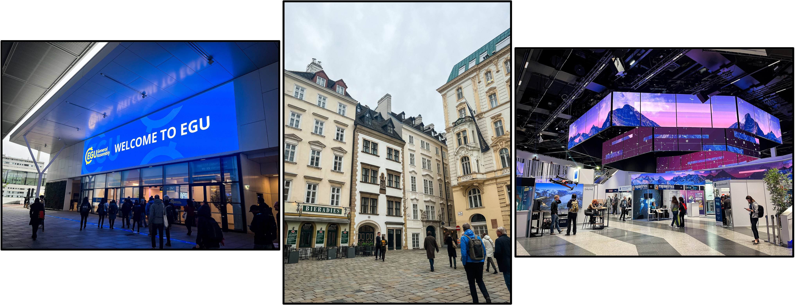
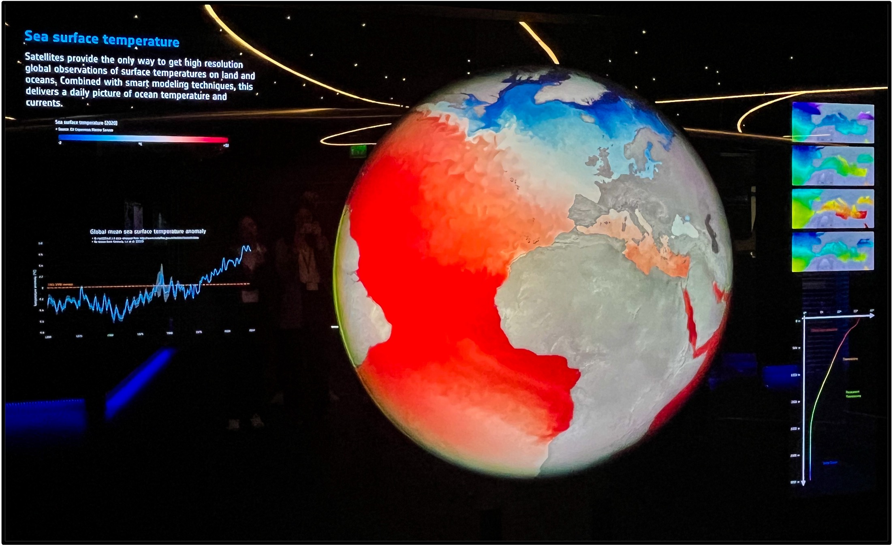
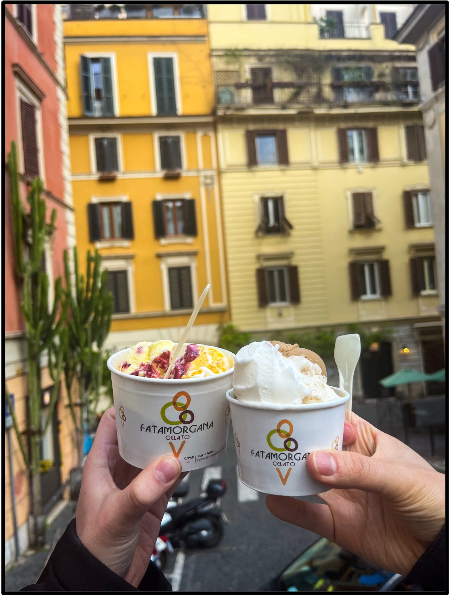

The past month brought exciting travel adventures to the SEAL lab as Izzi, Owen, Jenna, and Grace traveled to present their research at the European Geophysical Union (EGU) General Assembly in Vienna, Austria, and at the European Space Agency’s Centre for Earth Observation in Rome (Frascati), Italy where PI Dr. Josh Gray has been spending his sabbatical as a Visiting Scientist.

The journey began in Vienna, Austria where (after navigating international travel, lost baggage, and unique hostel rooms) we quickly learned how to navigate the Vienna metro system and made our way to the Austria Center Vienna. We had a lot of fun making new connections with remote sensing scientists and seeing how research is conducted and what organizations exist in countries outside of the United States. Our group had 3 oral talks, 1 lightning (PICO) talk, and 1 poster presentation with a diverse array of topics all focused on using time series of remote sensing data to study processes on Earth. For more details, see the abstracts linked at the end of this blog post.

After getting our fill of Wiener schnitzel and goulash, and even trying out some plum stew, EGU and our week in Austria came to a close. We came away with many new connections and insights into work related to our own and hope to one day again return to Austria Center Vienna! With that, we packed our bags and followed the call of fresh pizza, pasta, gelato, (and of course – satellites & science) over to Rome, Italy!

The second half of our journey took place in Rome, Italy where we visited the ESA ESRIN office where our PI Dr. Josh Gray has been doing his sabbatical as a Visiting Scientist studying phenology in drylands since the summer of 2023. During the visit, we each got the chance to present our own research as oral presentations to the ESA Science Hub Team. It was a great experience being able to present research, many of which use ESA satellites, to ESA scientists themselves! 

In addition to presenting and chatting with researchers, we got a tour of their [Earth observation multimedia center]( https://www.esa.int/About_Us/Earth_observation_multimedia_centre) where we got to interact with their data visualization center, long-term data preservation exhibit area, and memorabilia wall. Our favorites from this tour included the giant interactive globe visualization and the long-term record of satellite data storage and archives (see photos below).

After the ESRIN visit, the SEALs stayed a couple of extra days to sightsee and indulge in more gelato before heading back stateside. From the Roman Coliseum to the Trevi Fountain we were able to partake in the unique opportunity to learn more about Rome’s ancient history and culture. While just barely escaping getting trapped in the Vatican museums, we all managed to make it back home safely and are excited and invigorated to continue doing our research from our home base in Raleigh, North Carolina.

## SEAL Lab EGU Abstracts:

**Izzi Hinks**
•	[From Satellites to Soil: Integrating Satellite and Household Survey Data to Assess the Impacts of Adaptations on Smallholder Farmers’ Climate Resilience]( https://meetingorganizer.copernicus.org/EGU24/EGU24-14059.html)

**Josh Gray**
•	[Drought Changes Growing Season Length and Vegetation Productivity]( https://meetingorganizer.copernicus.org/EGU24/EGU24-14774.html)

**Eunhye (Grace) Choi**
•	[Understanding the role of vegetation responses to drought in regulating autumn senescence]( https://meetingorganizer.copernicus.org/EGU24/EGU24-13879.html)

**Owen Smith**
•	[Overcoming Big Data Challenges in Satellite Observation: A Variable Resolution Scheme for Modeling Land Surface Phenology]( https://meetingorganizer.copernicus.org/EGU24/EGU24-12119.html)

**Jenna Abrahamson**
•	[Multi-Sensor Space-Time Data Fusion of Machine Learning Generated Time Series for Wetland Inundation Monitoring]( https://meetingorganizer.copernicus.org/EGU24/EGU24-11476.html)
